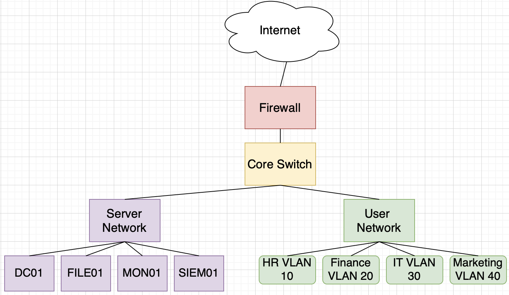

# Enterprise Infrastructure Design

## Overview
This project simulates an enterprise infrastructure environment for a medium-sized company with 100 employees.

## Objectives
- Design enterprise network architecture
- Implement network segmentation
- Plan server infrastructure
- Design security controls
- Prepare future implementation

## Company Structure
- HR
- Finance
- IT
- Marketing

## Infrastructure Components
- DC01 (Authentication & DNS)
- FILE01 (File Storage)
- MON01 (Monitoring)
- SIEM01 (Security Monitoring)

## Network Design
- VLAN 10 - HR
- VLAN 20 - Finance
- VLAN 30 - IT
- VLAN 40 - Marketing
- VLAN 50 - Server Network

## Architecture Diagram

## Security Controls
- Password Policy
- Account Lockout
- MFA for Administrators
- Daily Backup
- Security Logging

## Future Implementation
- Ubuntu Server Deployment
- Samba File Server
- Monitoring System
- SIEM Integration
